# Fieldline — Document Intelligence Platform

[](https://www.python.org/)
[](https://www.djangoproject.com/)
[](https://www.django-rest-framework.org/)
[](https://docs.celeryq.dev/)
[](https://groq.com/)
[](https://docs.pydantic.dev/)
[](https://www.sqlite.org/)

**Fieldline** is a full-stack document intelligence workspace: upload PDFs, extract structured fields with **Groq**, review low-confidence results, approve clean rows, and ship JSON / CSV / webhooks — from one operator UI.

> Portfolio project. Built end-to-end (product UI, session APIs, Celery extraction, Groq JSON, human review, data warehouse).

---

## Demo

| Asset | Link |
|-------|------|
| **Screenshots** | [`screenshots/`](./screenshots/) |

<p align="center">
  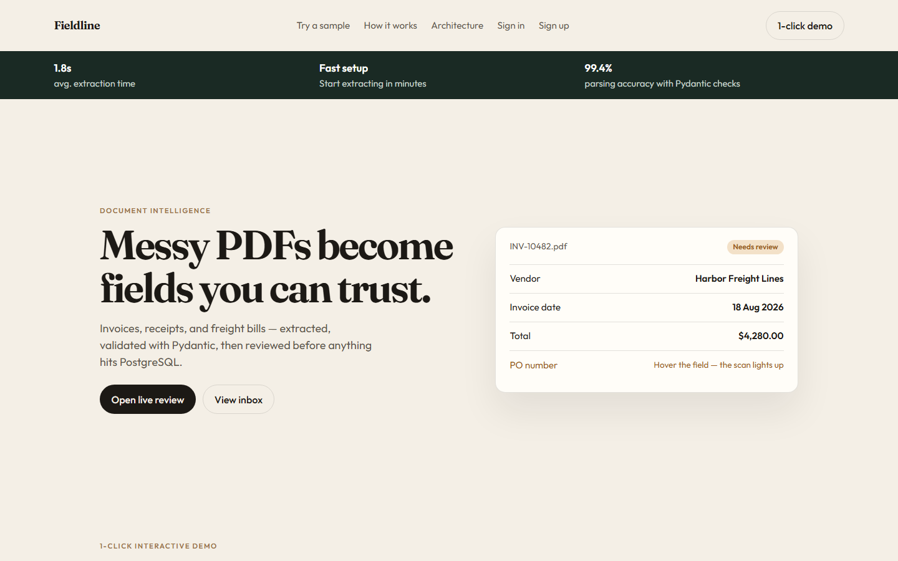
</p>

<p align="center">
  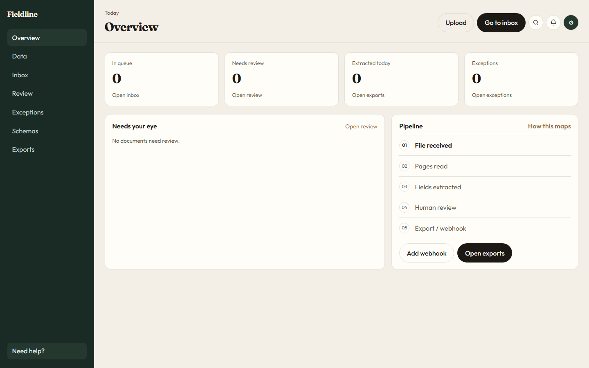
  &nbsp;
  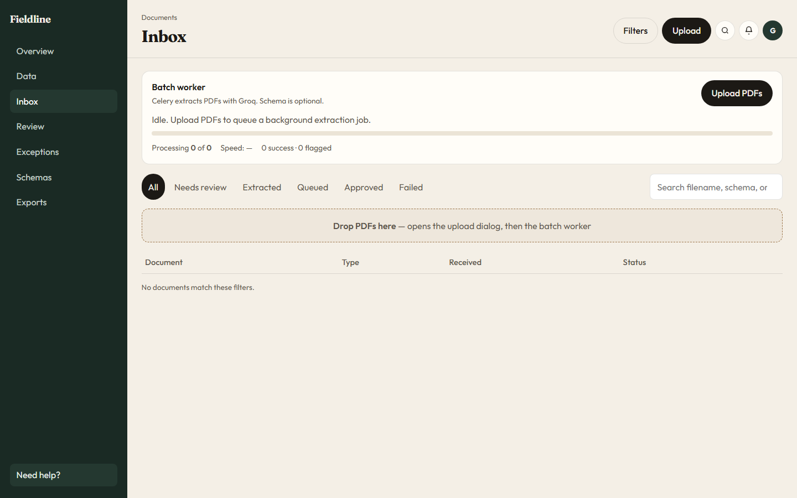
</p>

<p align="center">
  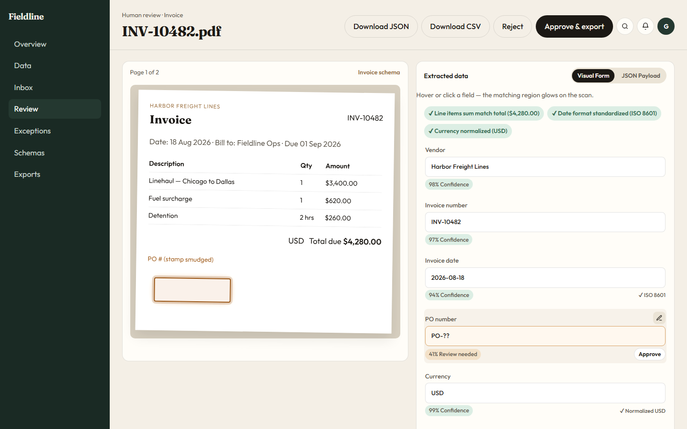
  &nbsp;
  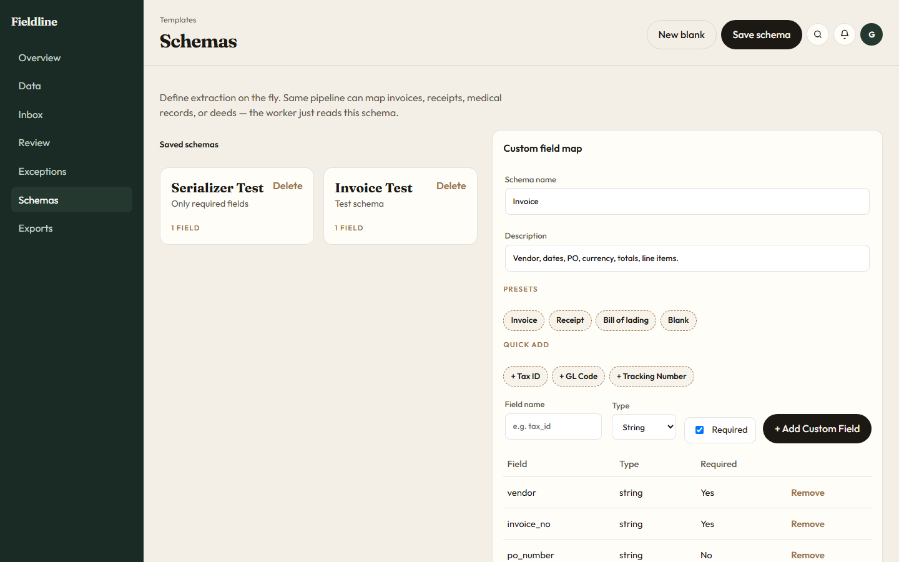
</p>

<p align="center">
  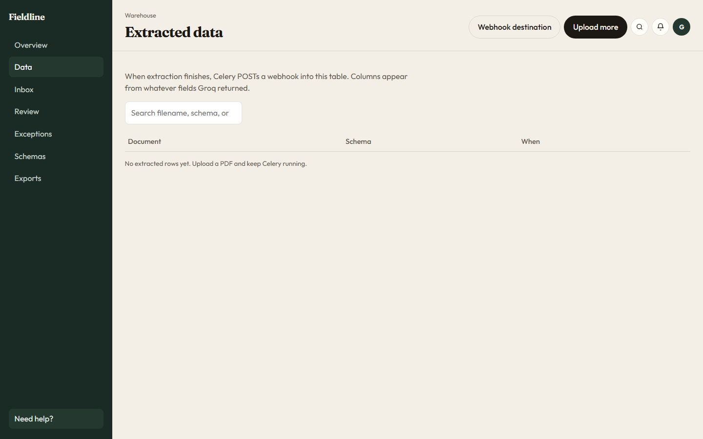
  &nbsp;
  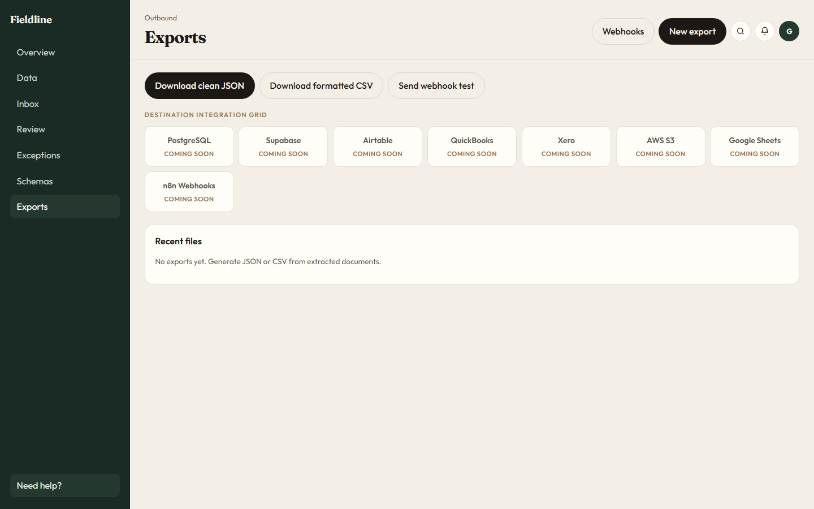
</p>

---

## Table of contents

1. [What I built vs Future](#what-i-built-vs-future)
2. [Features](#features)
3. [Code highlights](#code-highlights)
4. [Architecture](#architecture)
5. [Tech stack](#tech-stack)
6. [Project structure](#project-structure)
7. [Prerequisites](#prerequisites)
8. [Environment variables](#environment-variables)
9. [Setup & run](#setup--run)
10. [How each feature works](#how-each-feature-works)
11. [API reference](#api-reference)
12. [Pages / routes](#pages--routes)
13. [Background jobs](#background-jobs)
14. [Troubleshooting](#troubleshooting)

---

## What I built vs Future

Honest scope for recruiters and clients.

### What I built (working)

| Area | Delivered |
|------|-----------|
| **Auth** | Signup, login, logout (session cookie + DRF). Account modal uses the signed-in user. |
| **Schemas** | Save / list / delete extraction schemas. Infinite-scroll list in the UI. |
| **Upload** | Multi-PDF upload. Schema is **optional**. Files stored under `media/`. |
| **Extraction** | Celery job → `pypdf` text → Groq JSON. Statuses: `queued`, `processing`, `needs_review`, `extracted`, `approved`, `failed`. |
| **Review rules** | No schema → always **needs review**. Schema provided and every field filled → **extracted** (auto-ingest to Data). Any empty required/schema field → **needs review**. Groq fail → **failed**. |
| **Inbox / Exceptions** | Live list API with filters, search, retry, approve, reject. |
| **Human review** | Live PDF iframe + editable fields. Sample demos still work with `?doc=invoice\|receipt\|bol`. |
| **Data warehouse** | On `extracted`, Celery POSTs `/app/records/api/ingest/` (fallback writes locally if HTTP fails). Dynamic table columns from payload keys. |
| **Dashboard** | Live KPIs, attention list, pipeline steps. |
| **Exports** | JSON / CSV generate + download. HTTPS webhook destination (URL only) + ping test. |
| **Ops** | Windows-friendly Celery **filesystem broker** (no Redis required). Favicon + `X_FRAME_OPTIONS = SAMEORIGIN` for PDF preview. |

### Future / not claimed as live

| Item | Status |
|------|--------|
| Invite teammate | UI modal only |
| Forgot password | UI link only — no OTP / email pipeline |
| Destination integrations | PostgreSQL, Supabase, Airtable, QuickBooks, Xero, S3, Sheets, n8n — **Coming soon** on Exports |
| OAuth / MFA | Not implemented |
| Docker / AWS deploy | Not in this repo |
| Landing metrics (`1.8s`, `99.4%`) | Product copy on the marketing page, not measured production SLAs |

> Screenshots show the **working** product surface. Extraction requires a Groq key **and** a running Celery worker.

---

## Features

| Feature | Screenshot | What it does |
|---------|------------|--------------|
| **Landing** |  | Product homepage, sample CTAs, architecture story |
| **Sign in** | 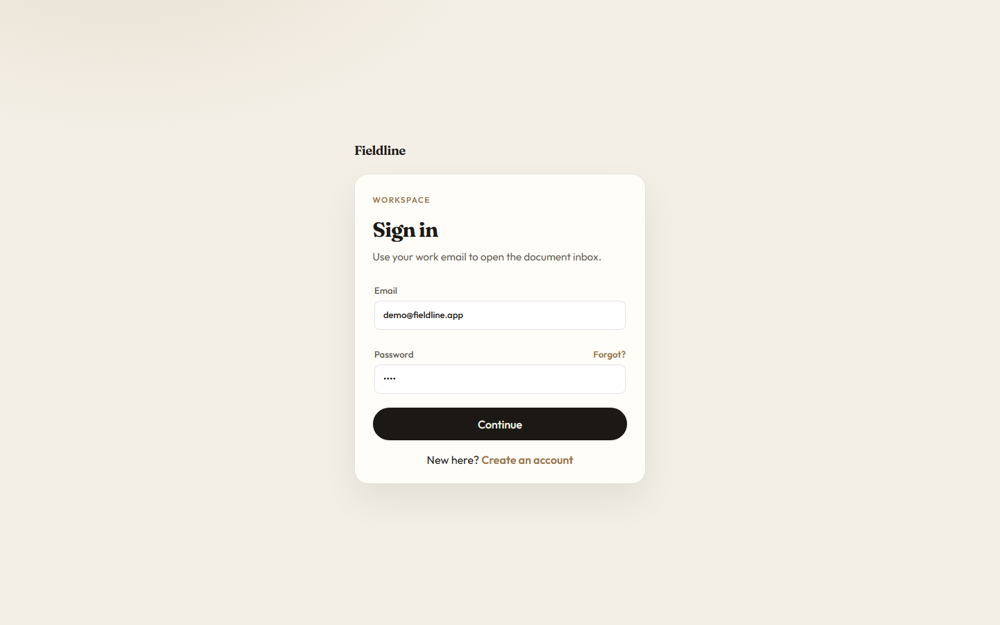 | Email/password workspace login |
| **Overview** |  | KPIs, review queue, pipeline steps |
| **Inbox** |  | Upload PDFs, batch worker, status filters |
| **Human review** |  | PDF + extracted form, approve / reject / JSON / CSV |
| **Schemas** |  | Custom field map Groq must fill |
| **Data** |  | Warehouse of extracted rows after a complete schema run |
| **Exports** |  | JSON, CSV, webhook test; extra destinations marked coming soon |

---

## Code highlights

Clean backend design — thin views, pipelines, and services (not logic dumped in templates).

**Contract everywhere:** Pydantic validates the request → pipeline returns `(success, message, payload)` → `success_response` / `error_response` → ModelSerializer out.

### Pipeline base class

`BasePipeline` is the template every feature reuses. Auth, dashboard, documents, schemas, exports, and records all return the same tuple.

```python
# accounts/pipelines/base_pipeline.py
class BasePipeline(ABC):
    """Every pipeline orchestrates one or more services to fulfil a single
    use case and must return a (success, message, payload) tuple."""

    @abstractmethod
    def process_item(self, data):
        raise NotImplementedError
```

### Dashboard API — pipeline + service layer

`DashboardOverviewApiView` stays thin: authenticate → `DashboardPipeline.process_overview()` → serialize KPIs.

```python
# dashboard/views.py
class DashboardOverviewApiView(APIView):
    authentication_classes = [SessionAuthentication]
    dashboard_pipeline = DashboardPipeline()

    def get(self, request):
        success, message, payload = self.dashboard_pipeline.process_overview(
            user=request.user,
        )
        return Response(
            success_response(
                message=message,
                data=DashboardOverviewSerializer(payload).data,
            )
        )
```

| File | What it shows |
|------|----------------|
| `accounts/pipelines/base_pipeline.py` | Shared `(success, message, payload)` contract |
| `dashboard/views.py` | Thin API + pipeline |
| `documents/pipelines/document_pipeline.py` | Upload, list, update, retry orchestration |
| `documents/services/extraction_service.py` | Status rules + Groq + webhook ingest |
| `fieldline/responses.py` | Consistent JSON envelope |
| `fieldline/pagination.py` | `has_more` pagination for infinite scroll |

---

## Architecture

### 1) How the whole app connects

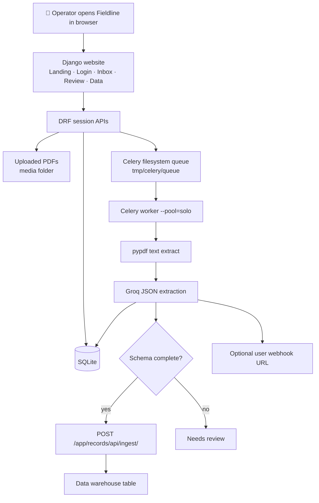

### 2) Upload a PDF → ready for review

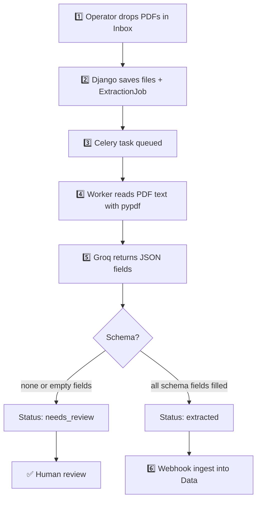

### 3) Human review → export

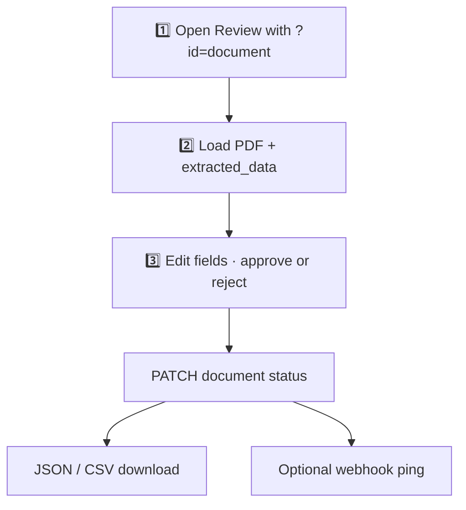

| What | Where it lives |
|------|----------------|
| Users, schemas, jobs, documents, records | SQLite (`db.sqlite3`) |
| PDF files | `media/` |
| Extraction JSON | Groq (`GROQ_MODEL`) |
| Background jobs | Celery + filesystem broker |
| Optional outbound webhook | `WebhookDestination.url` |

---

## Tech stack

| Layer | Technology |
|-------|------------|
| Web | Django 5.2, Django REST Framework |
| Validation | Pydantic v2 on the way in |
| Serializers | DRF ModelSerializer on the way out |
| Async jobs | Celery (`--pool=solo` on Windows) |
| Broker | Kombu filesystem (`CELERY_BROKER_URL=filesystem://`) — **no Redis required** |
| LLM | Groq (`openai/gpt-oss-120b` by default) |
| PDF text | pypdf |
| App UI | Custom CSS + vanilla JS |
| Database | SQLite (local) |

Windows filesystem transport needs **`pywin32`** (`pywintypes`). It is already in `requirements.txt`.

---

## Project structure

```
fieldline-document-intelligence/
├── accounts/                 # Signup, login, logout pages + APIs
├── dashboard/                # Overview page + KPI API
├── documents/                # Inbox, review, exceptions, Celery extraction
├── schemas/                  # Extraction schema builder + APIs
├── records/                  # Data warehouse + ingest webhook
├── exports/                  # JSON / CSV exports + webhook destination
├── pages/                    # Marketing landing
├── fieldline/                # Settings, Celery app, responses, pagination
├── static/                   # CSS + JS + favicon
├── templates/                # Shared chrome (sidebar, modals)
├── screenshots/              # Portfolio screenshots (committed)
├── manage.py
└── requirements.txt
```

---

## Prerequisites

1. **Python 3.11+**
2. A **Groq API key** for live extraction
3. Two processes while extracting: **Django runserver** and a **Celery worker**

Redis is **not** required for the default filesystem broker.

---

## Environment variables

Copy [`.env.example`](./.env.example) → `.env`. **Never commit real secrets.**

| Variable | Required | Purpose |
|----------|----------|---------|
| `GROQ_API_KEY` | For extraction | Groq chat completions |
| `GROQ_MODEL` | Optional | Default `openai/gpt-oss-120b` |
| `SECRET_KEY` | Recommended | Django secret |
| `CELERY_BROKER_URL` | Optional | Default `filesystem://` |
| `SITE_URL` | Optional | Default `http://127.0.0.1:8000` — used when Celery POSTs ingest |

`.env` is gitignored.

---

## Setup & run

### 1. Clone and virtualenv

```powershell
cd "<project-root>"
python -m venv .venv
.\.venv\Scripts\Activate.ps1
pip install -r requirements.txt
```

### 2. Configure `.env`

```powershell
copy .env.example .env
# Paste GROQ_API_KEY into .env
```

### 3. Database

This repo gitignores `migrations/`, so create them locally the first time:

```powershell
python manage.py makemigrations accounts dashboard documents schemas records exports
python manage.py migrate
python manage.py createsuperuser   # optional → /admin/
```

### 4. Start Django

```powershell
python manage.py runserver
```

### 5. Start Celery (second terminal)

Restart the worker after any Python change — it does **not** auto-reload.

```powershell
.\.venv\Scripts\celery -A fieldline worker -l info --pool=solo
```

Both must stay up for extraction **and** Data ingest (the worker HTTP-posts back to Django).

### 6. Open the app

| URL | Screen |
|-----|--------|
| http://127.0.0.1:8000/ | Landing |
| http://127.0.0.1:8000/signup/ | Create account |
| http://127.0.0.1:8000/login/ | Sign in |
| http://127.0.0.1:8000/app/ | Overview |
| http://127.0.0.1:8000/app/review/?doc=invoice | Sample review (no upload needed) |

---

## How each feature works

### Authentication

1. **Signup** validates with Pydantic (`full_name`, email, password ≥ 8, confirm match).
2. **Login** authenticates by email and sets a Django session.
3. **Logout** clears the session (page GET or `POST /logout/api/`).

### Schemas

Save a named field map (`field_name`, `field_type`, `field_required`). Upload can attach a schema or skip it. Presets exist in the UI for invoice / receipt / bill of lading.

### Documents & extraction

1. Upload PDFs → `ExtractionJob` + `Document` rows → `process_extraction_job.delay(job_id)`.
2. Worker: `pypdf` text → Groq JSON (schema keys, or open extraction if no schema).
3. Status:
   - **no schema** → `needs_review`
   - **schema complete** → `extracted` → ingest webhook → Data table
   - **schema incomplete** → `needs_review`
   - **Groq / empty PDF** → `failed`

**Without the Celery worker**, files save but extraction never starts.

### Human review

- Live: `/app/review/?id=<document.id>` loads the PDF and extracted fields from the API.
- Samples: `/app/review/?doc=invoice` (also `receipt`, `bol`) — UI demo without a database row.
- Approve / reject / retry hit real APIs (samples without an id stay UI-only).

### Data warehouse

When status becomes `extracted`, Celery POSTs JSON to `/app/records/api/ingest/`. If that HTTP call fails, `RecordService().ingest()` writes the row locally. Optional extra POST to the saved webhook URL.

### Exports

JSON and CSV downloads from extracted documents. Save a webhook URL and ping it (test payload). Extra SaaS destinations on the grid are **coming soon**.

---

## API reference

Session auth (`SessionAuthentication`). List endpoints use `CustomPagination` (`page`, `page_size`, `has_more`).

Envelope:

```json
{ "success": true, "message": "...", "data": {} }
```

### Auth

| Method | Path | Purpose |
|--------|------|---------|
| POST | `/signup/api/` | Register |
| POST | `/login/api/` | Login |
| POST | `/logout/api/` | Logout |

### Documents

| Method | Path | Purpose |
|--------|------|---------|
| POST | `/app/inbox/api/upload/` | Upload PDFs (`files`, optional `schema_id`) |
| GET | `/app/inbox/api/jobs/<id>/` | Job progress |
| GET | `/app/inbox/api/list/` | Inbox list (`status`, `search`, `schema_id`) |
| GET / PATCH | `/app/inbox/api/documents/<id>/` | Detail / update fields / status |
| POST | `/app/inbox/api/documents/<id>/retry/` | Re-queue extraction |

### Schemas / dashboard / records / exports

| Method | Path | Purpose |
|--------|------|---------|
| GET | `/app/api/overview/` | Dashboard KPIs |
| POST | `/app/schemas/api/save/` | Save schema |
| GET | `/app/schemas/api/list/` | List schemas |
| DELETE | `/app/schemas/api/<id>/` | Delete schema |
| POST | `/app/records/api/ingest/` | Warehouse ingest |
| GET | `/app/records/api/list/` | Warehouse list |
| POST | `/app/exports/api/create/` | Create JSON/CSV export |
| GET | `/app/exports/api/list/` | Export history |
| GET | `/app/exports/api/<id>/download/` | Download file |
| GET / POST | `/app/exports/api/webhooks/` | Get / save webhook URL |
| POST | `/app/exports/api/webhooks/test/` | Ping webhook |

Webhook test URL you can paste: `https://postman-echo.com/post` — expect **200 OK**.

---

## Pages / routes

| Path | Page |
|------|------|
| `/` | Landing |
| `/signup/`, `/login/`, `/logout/` | Auth |
| `/app/` | Overview |
| `/app/records/` | Data warehouse |
| `/app/inbox/` | Inbox |
| `/app/review/` | Human review |
| `/app/exceptions/` | Failed documents |
| `/app/schemas/` | Schema builder |
| `/app/exports/` | Exports |
| `/admin/` | Django admin |
| `/favicon.ico` | SVG favicon |

---

## Background jobs

| Task | When |
|------|------|
| `documents.process_extraction_job` | After PDF upload |
| `documents.process_single_document` | Retry from inbox / exceptions |

Broker folders (created automatically): `tmp/celery/queue` (in **and** out must be the same folder), `tmp/celery/processed`, `tmp/celery/control`.

---

## Troubleshooting

| Symptom | Fix |
|---------|-----|
| Upload OK, status stays `queued` | Start Celery with `--pool=solo`; restart it after code changes |
| Groq 404 / model missing | Set `GROQ_MODEL=openai/gpt-oss-120b` and restart Celery |
| `pywintypes` / filesystem broker error | `pip install pywin32` (already in requirements) |
| Data table empty after extract | Keep **runserver** up so ingest webhook can POST; schema must be complete |
| PDF iframe blank | `X_FRAME_OPTIONS` is `SAMEORIGIN`; confirm `file_url` on the document |
| `Could not start the background worker` | Celery process is not running |
| Line-ending warnings on `git add` | Harmless on Windows (`LF` → `CRLF`); add still succeeded |

```powershell
# Worker (Windows)
.\.venv\Scripts\celery -A fieldline worker -l info --pool=solo
```

---

Built as a portfolio document-intelligence product (**Fieldline**). Use your own Groq key; never commit `.env`.
